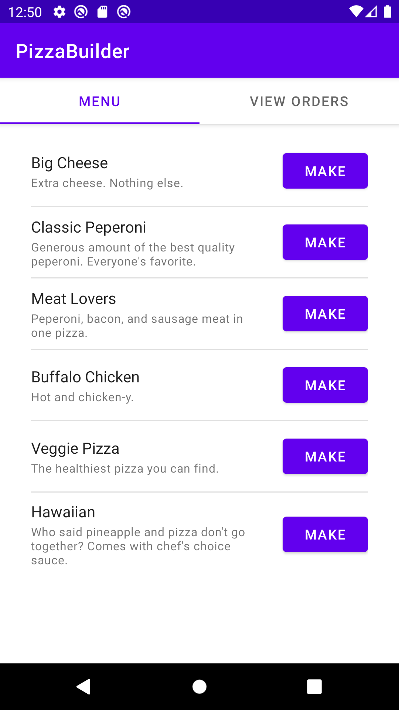
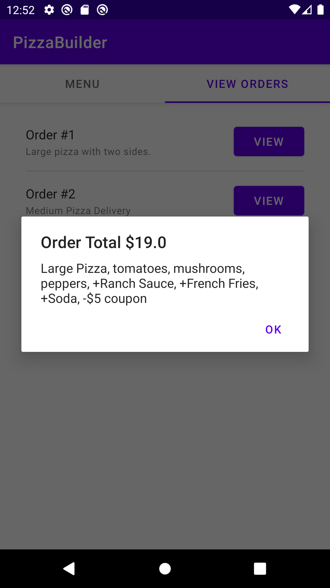
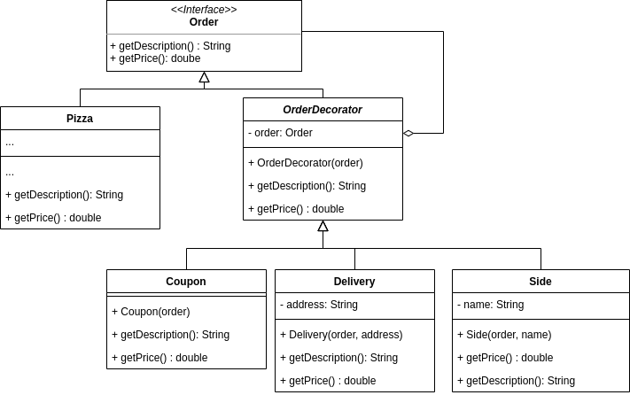

# Pizza Builder
COMP 730/830 Lab 4

 

## Objectives
- Learn how to use and implement Builder Design Pattern
- Learn how to use and implement Decorator Design Pattern

## Instructions
1. Go to `MenuTabFragment` and find how new `Pizza` objects are created. What do you think of this approach? 
2. To make the process of creating new Pizzas more independent and increase code readability apply 
   fluent Builder Pattern to `Pizza` class. Create static inner class `Builder` in the `Pizza` class that 
   allows to use method chaining to add toppings. It should have `build()` function that initializes and
   returns new fresh pizza. In the end you should be able to build pizza instances like this:

   ```java
   Pizza pizza = new Pizza.Builder(PizzaSize.MEDIUM)
      .addPineapples()
      .addChicken()
      .addPeppers()
      .build();
    ```

3. Review `Order` class and its components. Discuss potential issues when using the same approach on larger 
scale. For example: 
   * What happens if we decide to add more components to the `Order` (like new service)?
   * How the order will be used with different products (like Cheeseburger or Milkshake)? 
   * What are we going to do about order features or services that don't apply to some of the products? 
     For example, delivery won't be appropriate for Milkshakes. 
     
4. Use Decorator Pattern to make the `Order` design more flexible. The `Order` will become an interface
   with two methods `getDescription()` and `getPrice()`. It's an object that we will add new behaviors to,
   like description and price. They will be overloaded by `Pizza` class and `OrderDecorator`s. `OrderDecorator`
   wraps an instance of `Order` and uses it to return it's price and description. `OrderDecorator` is abstract and has 
   subclasses: `Coupon`, `Delivery`, `Side`. They are the order's features. We will use them to decorate 
   `Order` objects. See the diagram below for more details.
   
   
